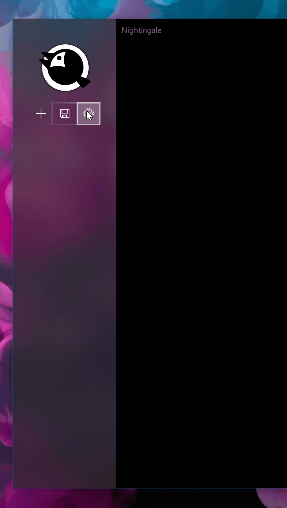

# uwp-fancy-xaml-panel

Sample UWP app with a custom fancy panel that flies into view. This control originated from [Nightingale REST API Client](https://www.microsoft.com/en-us/p/nightingale-rest-api-client/9n2t6f9f5zdn) as seen below: 

